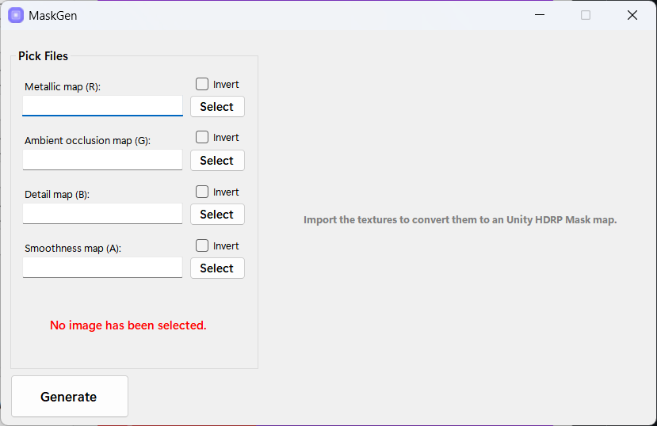
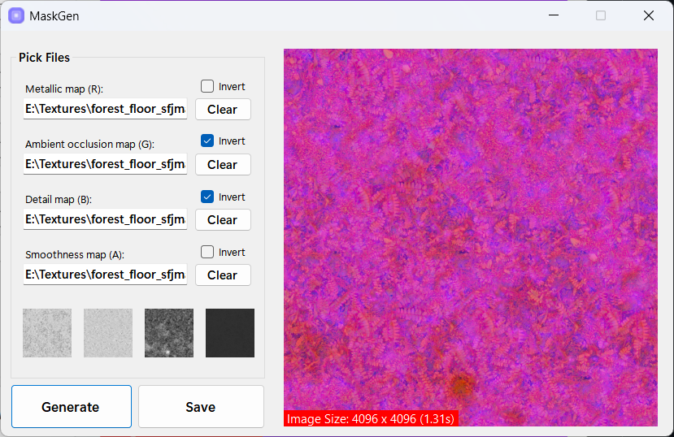

# Unity Mask Map Generator

## Overview
The Unity Mask Map Generator is a C# desktop application designed to streamline the process of creating mask maps for Unity HDRP projects. This tool allows developers to easily combine different texture maps into a single mask map, optimizing their materials and improving rendering performance.

[Get it here](https://maskgen.up.railway.app)

## Features
- Import and combine texture maps: Metallic, Ambient Occlusion, Detail, and Smoothness.
- User-friendly interface with clear options and an intuitive workflow.
- "Invert" checkboxes for each texture map to provide additional control over the output.
- Efficient generation of mask maps with a single click using a highly parallel engine built on [Coroutines](https://github.com/styropyr0/Coroutines).

## Installation
The installation files are inside the Installer directory. Run the Setup.exe to install the software. You need .NET v8.0 or later to run the app.

## Usage
1. Open the Unity Mask Map Generator.
2. Import the texture maps by clicking the corresponding "Browse" buttons for Roughness, Ambient Occlusion, Detail, and Smoothness maps.
3. Use the "Invert" checkboxes if needed to invert any of the texture maps.
4. Click the "Generate" button to create the mask map.
5. The generated mask map will be saved in the specified output directory.

## Coroutines Library
This project leverages the [Coroutines for C#](https://github.com/styropyr0/Coroutines) library to accelerate image processing. Inspired by Kotlin's coroutine model, this library provides:
- Dispatcher abstraction for flexible threading (IO, Main, Default, Unconfined).
- Coroutine scopes with cancellation and timeout support.
- Parallel execution via `CoroutineBuilder` and `GlobalScope`.
- Suspension utilities for timed or conditional delays.

By integrating Coroutines, the mask generation process achieves high concurrency and responsiveness, even when processing large batches of textures.

## Screenshots

## Contribution
If you'd like to contribute to the project, please fork the repository and use a feature branch. Pull requests are warmly welcome.

## License
This project is licensed under the AGPL-3.0 License - see the [LICENSE](#) file for details.
